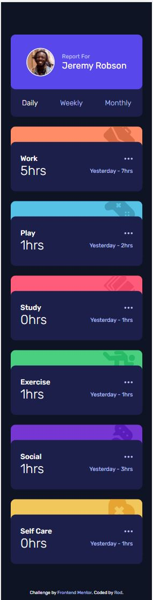
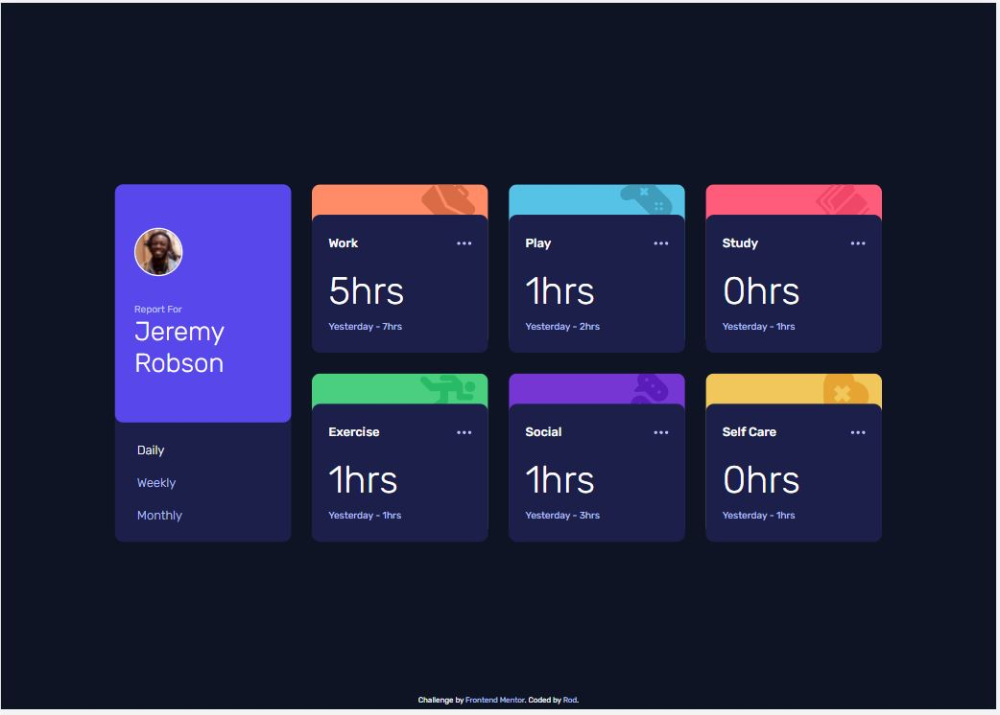

# FM - Time tracking dashboard solution

This is a solution to the [Time tracking dashboard challenge on Frontend Mentor](https://www.frontendmentor.io/challenges/time-tracking-dashboard-UIQ7167Jw). Frontend Mentor challenges help you improve your coding skills by building realistic projects.

## Table of contents

- [Overview](#overview)
  - [The challenge](#the-challenge)
  - [Screenshots](#screenshots)
  - [Links](#links)
- [My process](#my-process)
  - [Built with](#built-with)
  - [What I learned](#what-i-learned)

## Overview

### The challenge

Users should be able to:

- View the optimal layout for the site depending on their device's screen size
- See hover states for all interactive elements on the page
- Switch between viewing Daily, Weekly, and Monthly stats (_see process_)

### Screenshots

\

### Links

[View Live Here](https://bague-rodnel.github.io/time-tracking-dashboard/)

## My process

On the screenshot of the target active states there seems to be a hover/active state for the card body (content) as well as for the ellipsis in the header.

I decided I will do a :hover style on the card body. Turn it off at :active.
Another :active on the ellipsis.

This way when the ellipsis is :active. The card body returns to normal style and doesn't compete for attention.

### Built with

- Semantic HTML5 markup
- Sass
- Flexbox
- CSS Grid
- Mobile-first workflow
- JavaScript

### What I learned

I learned that you can fetch a local file with the fetch api if you don't fancy the import approach
